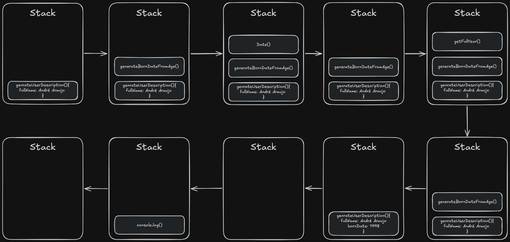

### Introduction to Node.js

#### What's Node.js?

Node.js is a JavaScript runtime environment that runs on top of an engine known as "Google V8".

#### Why was Node.js created?

It was born from an idea by Ryan Dahl due to the need to solve the problem of tracking file upload progress without having to poll the server.

**Keywords :** `Pooling` `Breaking Changes` `Express` `Socket.IO` `IO.js` `Node.js Foundation` 

---

### The Google V8

#### What's Google V8?

V8 is an engine created by Google to be used in the Chrome browser. Google made it open-source and named it the Chromium project.

#### Google V8 and JavaScript

JavaScript is an interpreted language; every line of code needs to be interpreted at runtime. V8 compiles the code into machine code and drastically optimizes execution using heuristics, allowing execution to happen on top of compiled code rather than interpreted code.

**Keywords :** `V8` `Chromium Project` `Heuristics` `Compiled Code` `Interpreted Code`

---

### Understanding the Node.js single thread

Node.js has an excellent solution for the problem of excessive resource consumption caused by executing each new request in a separate operating system thread, as is done by languages like Java, PHP, and Ruby. Node.js utilizes asynchronous programming and shared resources to get the most out of a single thread.

> "The most common scenario is a web server that receives millions of requests per second; if the server starts a new thread for each request, it will generate a high resource cost, and it will become increasingly necessary to add new servers to support the demand. The single-thread asynchronous model can process more concurrent requests than the previous example, using far fewer resources."

**Keywords :** `Single Thread` `Asynchronous programming` `Shared Resources` `Non-blocking asynchronous I/O`

---

### Non-blocking asynchronous I/O

The most powerful feature of Node.js is its non-blocking (asynchronous) nature, which facilitates parallel execution and optimal resource utilization.

Each action will be executed only after the previous action has been completed:
> Synchronous implementation: [synchronous-process.js](./scripts/synchronous-process.js)

Enables actions that are independent of each other to be unblocked:
> Asynchronous implementation: [asynchronous-process.js](./scripts/asynchronous-process.js)

> To solve this problem, Node.js relies on a feature called high-order functions. High-order functions allow passing a function as a parameter to another function, and these functions passed as parameters will be executed later.

**Keywords:** `High Order Functions` `Callbacks`

---

### Event Loop

> Node.js is an event-driven language.

In short, the Node.js event loop is a control flow determined by events or state changes. Most implementations have a core that listens to all events and calls their respective callbacks when they are triggered (or have their state changed).

**Keywords:** `Event Driven`

--- 

### Call Stack

Whenever a function is executed, it enters the stack, which executes only one thing at a time. This means that any code following the one currently running must wait for the current function to finish executing before moving forward.

> Call Stack implementation: [call-stack.js](./scripts/call-stack.js)

    Understanding how the stack works, it can be concluded that functions requiring a lot of execution time will occupy the stack longer, thus blocking subsequent lines from being called.

---

### Multithreading